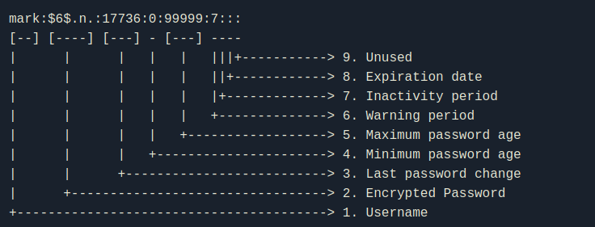

# Users and Group Management

## Add, Modify, and Remove Users and Groups

### Adding Users

``` 
useradd [options] USERNAME`
```

- **Example**:
```
sudo useradd mo
```
- **Options**:

- `-m`: Create the user's home directory.
- `-s /bin/bash`: Set the user's default shell.


---

### Modifying Users

```
usermod [options] USERNAME`
```

- **Example**:
```bash
sudo usermod -aG sudo mo
```

- **Options**:
- `-aG GROUP`: Add the user to a new group without removing them from other groups.
- `-l NEW_USERNAME`: Change the username.
- `-d /new/home`: Change the user's home directory.

- ps: group modification for users (add , removing ) can also be done form the config file in `/etc/group`. 
---


### Removing Users

```
userdel [options] USERNAME`
```

- **Example**:
```
sudo userdel johndoe
```

- **Options**:
- `-r`: Remove the user's home directory and mail spool.

---

### Adding Groups

```
groupadd [options] GROUPNAME`
```

- **Example**:
```bash
sudo groupadd developers
```
---

### Modifying Groups

```
groupmod [options] GROUPNAME`
```

- **Example**:
```bash
sudo groupmod -n newgroupname oldgroupname
```

---


### Removing Groups

```
groupdel GROUPNAME`
```
- **Example**:
```bash
sudo groupdel developers
```


---


## Manage User/Group Info in Password/Group Databases

### Understanding `/etc/passwd`

- **File**: `/etc/passwd`
- **Purpose**: Stores essential information about users.

### Understanding `/etc/group`

- **File**: `/etc/group`
- **Purpose**: Stores information about groups.


---


## Create and Manage Special Purpose and Limited Accounts

### Creating System Users

- **Purpose**: System users are non-human accounts used for running services.
- **Command**: `useradd`
- **Syntax**: `useradd -r -s /usr/sbin/nologin SYSTEM_USER`
- **Example**:

```bash
sudo useradd -r -s /usr/sbin/nologin backupuser
```

---

### Creating Limited Accounts

- **Purpose**: Limited accounts have restricted access, often used for guests or specific tasks.
- **Command**: `useradd`
- **Syntax**: `useradd -m -s /usr/sbin/nologin LIMITED_USER`
- **Example**:

```bash
sudo useradd -m -s /usr/sbin/nologin guestuser
```
passwrod content gets stored in the 

```
/etc/shadow   
```
Use  for images.


typically, the first line describes the root user, followed by the system and normal user accounts. New entries are appended at the end of the file.

Each line of the /etc/shadow file contains nine comma-separated fields:


---


### Managing Permissions for Special Accounts

- **Commands**:
- `chown`: Change ownership of files and directories.
```bash
sudo chown user:group /path/to/file
```
- `chmod`: Change file permissions.
```bash
sudo chmod 700 /path/to/directory
```
- `setfacl`: Set Access Control Lists (ACLs) for fine-grained permission control.
```bash
sudo setfacl -m u:username:rwx /path/to/directory
```

---

### Lock Accounts

we can locke acounts using

```
usermod -L username
```

then we can unlock it using 


```
usermod -U username
```


